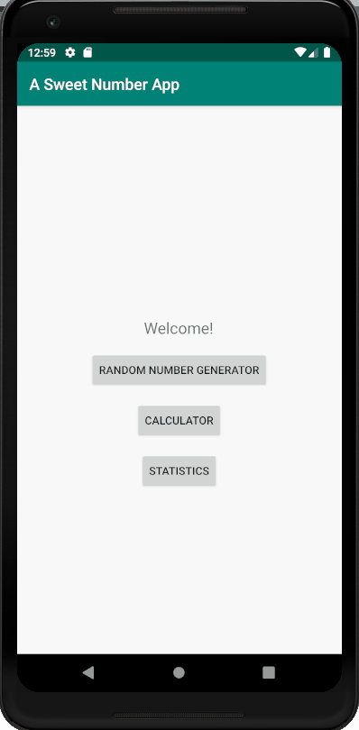
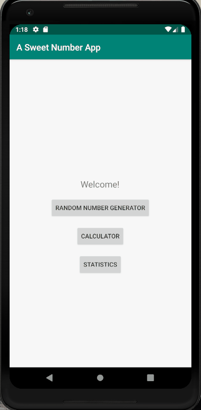

# AndroidNumberApp
This app is designed to be a one stop shop for all things you may want to do with numbers. Includes a random number generator, a calculator, and a statistics section.

## Part 1
  A random number generator. User can select the range the random number is selected from, with a floor of 1 and up to a ceiling of 10.
  
  The code and idea for this was based on this YouTube video by TreeHouse: https://www.youtube.com/watch?v=EOfCEhWq8sg&t=255s

  
  
## Part 2

  The second part is a calculator. It shows the history of calculations, has the ability to switch between positive and negative, and can clear all of memory. 

  
  
## Part 3

  Part 3 is for statistics. Here the user can enter in a set of numbers, and then the app will calculate and display the mean, median, mode, and range. 

  
  
## Part 4?

Might try to update the UI to be more than the default Android UI. Might try to add another section that allows for matrix multiplication, we will see. 
